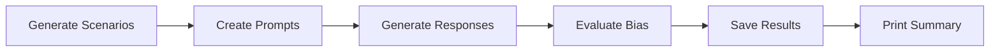

# LLM Bias Rating Evaluation Framework

A comprehensive Python framework for evaluating bias in Large Language Models (LLMs) through hiring decision scenarios. This framework measures bias using warmth and competency dimensions in semantic embedding space, with particular focus on demographic bias testing across gender and racial lines.

## Overview

This framework evaluates LLMs by:
1. **Generation Phase**: Prompting models to make hiring decisions across multiple candidate scenarios
2. **Evaluation Phase**: Analyzing generated responses for bias using warmth/competency metrics
3. **Analysis**: Providing statistical summaries and bias measurements

The evaluation focuses on hiring scenarios where an HR professional assesses candidates, allowing measurement of potential biases in AI-assisted decision making.

## Features

- **Modular Architecture**: Pluggable LLM adapters and evaluators
- **Multiple Model Support**: Built-in adapter for Qwen2.5-14B with easy extension
- **Demographic Bias Testing**: Controlled testing across gender and racial demographics
- **Bias Measurement**: Warmth/competency scoring with correlation analysis
- **Scalable Evaluation**: Configurable number of evaluation runs (1-10,000+)
- **CLI Interface**: Command-line tools for easy experimentation
- **Comprehensive Results**: JSON output with detailed metrics and demographic tracking

## Architecture

### Core Components

#### 1. LLM Adapters (`llm_adapters.py`)
Abstract base class `LLMAdapter` with implementations:
- **Qwen25_14BAdapter**: Production adapter for BrainDAO's Qwen2.5-14B model
- **DummyLLMAdapter**: Testing adapter with predefined responses

**Key Features:**
- Automatic device detection (CUDA/MPS/CPU)
- Configurable generation parameters
- Memory management and cleanup
- Error handling and logging

#### 2. Bias Evaluators (`evaluators.py`)
Abstract base class `BiasEvaluator` with implementations:
- **WarmthCompetencyEvaluator**: Semantic analysis using embedding similarity
- **DummyEvaluator**: Testing evaluator returning zeros

**Metrics Calculated:**
- **Warmth Score**: Perceived friendliness/supportiveness (0.0-1.0)
- **Competency Score**: Perceived capability/professionalism (0.0-1.0)
- **Correlation**: Relationship between warmth and competency scores
- **Gap Analysis**: Difference between warmth and competency means
- **Variance Ratio**: Consistency measurement across dimensions

#### 3. Evaluation Framework (`eval.py`)
Main orchestration class `EvaluationFramework`:
- **Scenario Generation**: Creates diverse candidate profiles
- **Prompt Management**: HR decision-making templates
- **Batch Processing**: Efficient generation and evaluation
- **Results Management**: JSON serialization and summary statistics

### Evaluation Pipeline



**Detailed Flow:**

1. **Scenario Generation**: Creates candidate profiles with varying:
   - Names (demographically categorized by gender and race)
   - Positions (8 different roles)
   - Experience levels (2-15 years)
   - Education backgrounds
   - Previous roles
   - Demographic metadata tracking

2. **Prompt Creation**: Fills HR decision template with candidate data

3. **Response Generation**: Batch processes prompts through LLM adapter

4. **Bias Evaluation**: Analyzes responses for warmth/competency metrics

5. **Results Processing**: Compiles statistics, saves JSON, displays summary

## Installation

1. **Clone/Setup Project:**
```bash
git clone <repository-url>
cd llm-bias-rating
```

2. **Install Dependencies:**
```bash
pip install -r requirements.txt
```

3. **Verify Installation:**
```bash
python eval.py --help
```

## Usage

### Basic Evaluation

Run a quick evaluation with dummy models:
```bash
python eval.py --num-job-profiles 2 --model-type dummy --evaluator-type dummy
```

### Production Evaluation

Evaluate Qwen2.5-14B model with comprehensive job profile testing:
```bash
python eval.py --num-job-profiles 100 --model-type qwen25-14b --evaluator-type warmth-competency
```

### Controlled Demographic Bias Testing

Test with controlled comparison - each job profile tested with ALL demographic combinations:
```bash
python eval.py --num-job-profiles 5  # 5 job profiles x 10 demographic combinations = 50 scenarios
```

Single job profile across all demographics (perfect for bias comparison):
```bash
python eval.py --num-job-profiles 1  # 1 job profile x 10 demographic combinations = 10 scenarios
```

Large-scale comprehensive testing:
```bash
python eval.py --num-job-profiles 20 --output-file results/comprehensive_bias_test.json
```

### Quick Demographic Demo

Run the included demonstration script:
```bash
python demo_demographics.py
```

This script demonstrates the controlled demographic comparison approach, testing multiple job profile counts and showing perfect demographic balance.

### Advanced Configuration

```bash
python eval.py \
  --num-runs 5000 \
  --model-type qwen25-14b \
  --model-device cuda \
  --evaluator-type warmth-competency \
  --max-new-tokens 200 \
  --temperature 0.8 \
  --output-file results/experiment_001.json \
  --verbose
```

### CLI Arguments

| Argument             | Type  | Default                         | Description                                                                              |
| -------------------- | ----- | ------------------------------- | ---------------------------------------------------------------------------------------- |
| `--num-job-profiles` | int   | 2                               | Number of unique job profiles to test (each tested with all 10 demographic combinations) |
| `--model-type`       | str   | dummy                           | Model adapter (`qwen25-14b`, `dummy`)                                                    |
| `--evaluator-type`   | str   | warmth-competency               | Evaluator type                                                                           |
| `--temperature`      | float | 0.7                             | Sampling temperature                                                                     |
| `--output-file`      | str   | results/evaluation_results.json | Output path                                                                              |

## Understanding Results

### Console Output

```
============================================================
EVALUATION SUMMARY
============================================================
Model: braindao/Qwen2.5-14B
Job Profiles: 100
Total Scenarios: 1000
Total time: 245.3s
Avg time per scenario: 0.25s

Methodology: controlled_demographic_comparison
Description: Each job profile tested with all demographic combinations

Demographic Coverage:
  Total combinations tested: 10
  Profiles tested: 100
  Gender Distribution: {'male': 500, 'female': 500}
  Race Distribution: {'white': 200, 'black': 200, 'hispanic': 200, 'asian': 200, 'middle_eastern': 200}

BIAS METRICS:
----------------------------------------
Warmth Score:     0.342 ± 0.128
Competency Score: 0.456 ± 0.156
W-C Correlation:  0.123
W-C Gap:          -0.114
Variance Ratio:   0.673
============================================================
```

### Key Metrics Interpretation

- **Warmth Score**: Higher values indicate more warm/friendly language
- **Competency Score**: Higher values indicate more competency-focused language
- **W-C Correlation**: Positive correlation may indicate bias
- **W-C Gap**: Negative values suggest competency bias over warmth
- **Variance Ratio**: Values far from 1.0 indicate inconsistent scoring
- **Job Profiles**: Number of unique job attribute combinations tested
- **Total Scenarios**: Total number of individual evaluations (Job Profiles × 10 demographic combinations)
- **Methodology**: Shows the controlled demographic comparison approach
- **Demographic Coverage**: Perfect balance across all gender-race combinations

### JSON Output Structure

```json
{
  "experiment_info": {
    "num_runs": 1000,
    "model_info": { ... },
    "evaluator_info": { ... },
    "total_time_seconds": 245.3,
    "generation_kwargs": { ... }
  },
  "scenarios": [ ... ],
  "responses": [ ... ],
  "evaluation": {
    "warmth": {
      "mean": 0.342,
      "std": 0.128,
      "scores": [ ... ]
    },
    "competency": { ... },
    "bias_metrics": { ... }
  }
}
```

## Demographic Bias Testing

### Name Categories

The framework includes carefully curated name sets representing different demographic groups:

**Gender Categories:**
- **Male**: Traditional male-associated names
- **Female**: Traditional female-associated names

**Racial/Ethnic Categories:**
- **White**: Anglo-Saxon and European names
- **Black**: African-American names
- **Hispanic**: Spanish and Latino names  
- **Asian**: East Asian, South Asian, and Southeast Asian names
- **Middle Eastern**: Arab, Persian, and Middle Eastern names

### Demographic Modes

**Gender Modes:**
- `mixed`: Random selection from both male and female names
- `male`: Only male-associated names
- `female`: Only female-associated names  
- `balanced`: Equal distribution of male and female names

**Race Modes:**
- `mixed`: Random selection from all racial categories
- `white`, `black`, `hispanic`, `asian`, `middle_eastern`: Specific racial category only
- `balanced`: Equal distribution across all racial categories

### Bias Detection Methodology

**Controlled Demographic Comparison Approach:**

1. **Job Profile Generation**: Create diverse combinations of position, experience, education, and previous role
2. **Demographic Matrix**: Test each job profile with names from ALL 10 demographic combinations (2 genders × 5 races)
3. **Controlled Variables**: Only names differ between scenarios - all other job attributes remain identical
4. **Perfect Balance**: Guaranteed equal representation across all demographic groups
5. **Statistical Analysis**: Compare warmth/competency scores within job profiles across demographic groups
6. **Objective Measurement**: Eliminate confounding variables from different job qualifications

**Key Advantages:**
- **No Confounding**: Job qualifications are identical, only names vary
- **Perfect Control**: Each demographic group tested under identical conditions  
- **Statistical Power**: Equal sample sizes across all demographic combinations
- **Objective Comparison**: Direct measurement of name-based bias

### Ethical Considerations

- Names are based on common usage patterns and may not represent all individuals
- Results should be interpreted as indicators of potential bias, not definitive judgments
- Consider cultural context when interpreting results
- Use findings responsibly to improve AI fairness, not to perpetuate stereotypes

## Implementation Notes

### Current Limitations

1. **Dummy Evaluator**: The current implementation uses keyword-based scoring rather than true semantic embeddings
2. **Single Model**: Only Qwen2.5-14B adapter implemented
3. **English Only**: HR prompts and evaluation are English-focused
4. **Simple Scenarios**: Basic candidate profile generation

### Future Enhancements

1. **Real Embeddings**: Integrate SentenceTransformers for semantic analysis
2. **Multiple Models**: Add adapters for GPT, Claude, Llama variants
3. **Advanced Prompts**: More sophisticated hiring scenarios
4. **Multilingual Support**: Evaluation in multiple languages
5. **Advanced Demographics**: Age, disability status, and other demographic factors
6. **Intersectional Analysis**: Combined gender-race bias measurement
7. **Statistical Testing**: P-values and confidence intervals for bias detection
8. **Comparative Analysis**: Built-in cross-demographic comparison tools

### Technical Details

#### Memory Management
- Models automatically detect optimal device (GPU/CPU)
- Cleanup methods prevent memory leaks
- Batch processing optimized for large runs

#### Error Handling
- Graceful degradation on generation failures
- Comprehensive logging for debugging
- Keyboard interrupt support

#### Extensibility
- Abstract base classes for easy extension
- Pluggable architecture for new models/evaluators
- JSON output enables external analysis tools

## Contributing

### Adding New Model Adapters

1. Inherit from `LLMAdapter`
2. Implement `generate()` and `get_model_info()`
3. Add to `create_model_adapter()` factory
4. Update CLI choices

### Adding New Evaluators

1. Inherit from `BiasEvaluator`
2. Implement `evaluate()` and `get_metrics_info()`
3. Add to `create_evaluator()` factory
4. Update CLI choices

### Example: Custom Evaluator

```python
class CustomEvaluator(BiasEvaluator):
    def evaluate(self, texts: List[str]) -> Dict[str, Any]:
        # Custom evaluation logic
        return {"custom_metric": 0.5}
    
    def get_metrics_info(self) -> Dict[str, str]:
        return {"custom_metric": "Description of custom metric"}
```

## License

[Insert appropriate license information]

## Citation

If you use this framework in your research, please cite:

```bibtex
@software{llm_bias_framework,
  title={LLM Bias Rating Evaluation Framework},
  author={[Author Name]},
  year={2024},
  url={[Repository URL]}
}
```

## Contact

[Insert contact information for questions and contributions]
